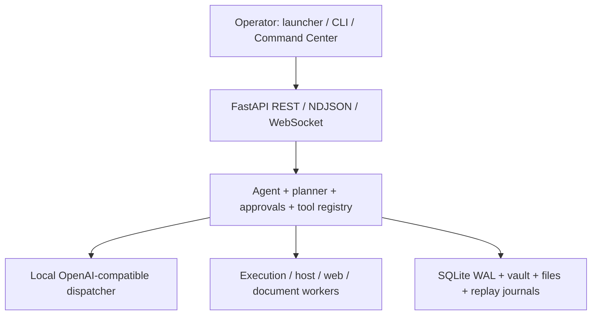

# System map

Startup: `jarvis.cmd` resolves repo, delegates to `jarvis-launcher.ps1`, prepares runtime/token/profile, controls dispatcher/backend/frontend, and records launcher state. Backend lifespan acquires the primary lease, initializes/reconciles storage/execution, starts supervisors and serves API. Shutdown must cancel supervisors/workers and release state.

Response path: UI/CLI -> API -> agent context/persona/memory -> LLM/tool loop -> approval/execution -> storage/audit/event bus -> NDJSON/UI. Web/document content is untrusted data but crosses separate core HTTP, Playwright worker, parser and synthesis paths. Persistent state includes main SQLite/WAL, playbook SQLite, vault Markdown, downloads/uploads/document outputs, launcher JSON, replay/checkpoint journals and model/runtime directories under `D:\jarvis`.

Privilege transitions: browser/server input -> model prompt; model proposal -> schema/tool policy; tool -> approval; approval -> exact execution capability; container -> host bridge; browser worker -> network/runtime. Findings identify where those transitions differ across implementations.
